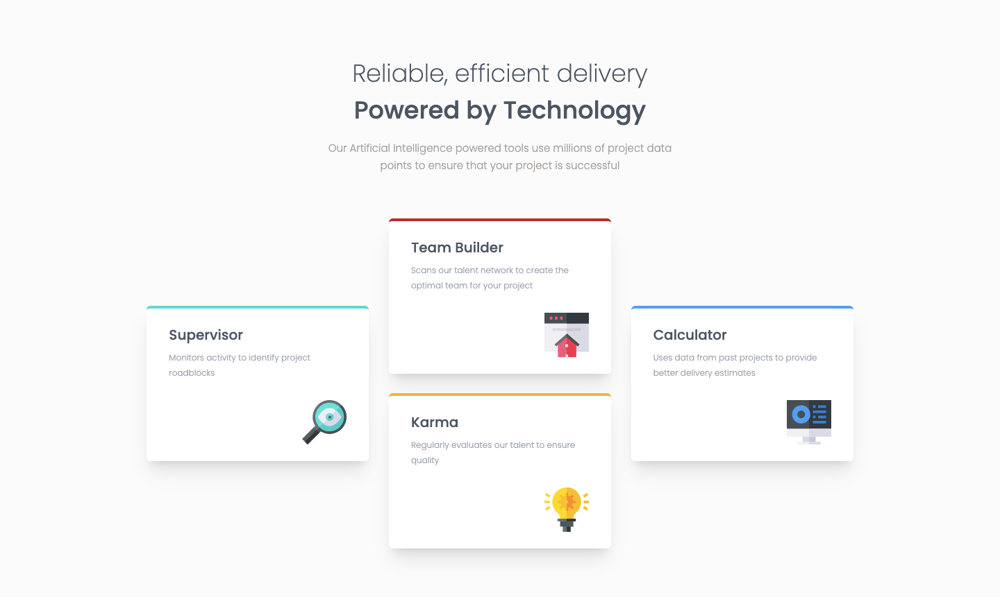

# Frontend Mentor - Four card feature section

This is a solution to the [Four card feature section challenge on Frontend Mentor](https://www.frontendmentor.io/challenges/four-card-feature-section-weK1eFYK/hub). Frontend Mentor challenges help you improve your coding skills by building realistic projects. 

## Table of contents

- [Overview](#overview)
  - [Screenshot](#screenshot)
  - [Links](#links)
- [My process](#my-process)
  - [Built with](#built-with)
- [Author](#author)

## Overview

### Screenshot

### Links

- Solution URL: (https://www.frontendmentor.io/solutions/four-card-feature-section-using-tailwind-and-react-HfyziOKC8z)

## My process

### Built with

-  HTML
- [Tailwind](https://tailwindcss.com/)
- [React](https://react.dev/)

## Author

- Frontend Mentor - [@mahdyrll](https://www.frontendmentor.io/profile/mahdyrll)
